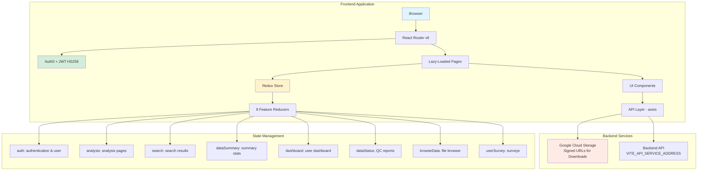
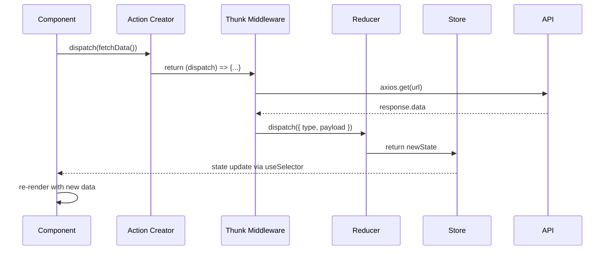
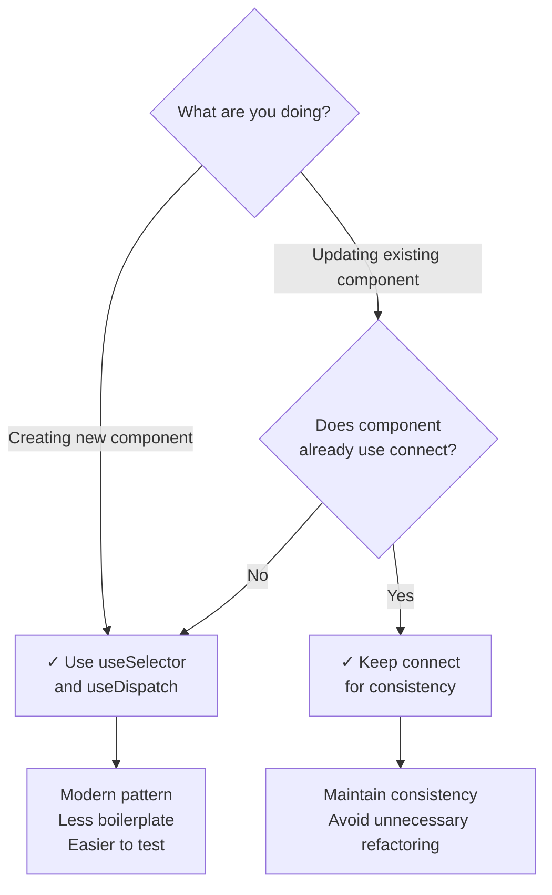
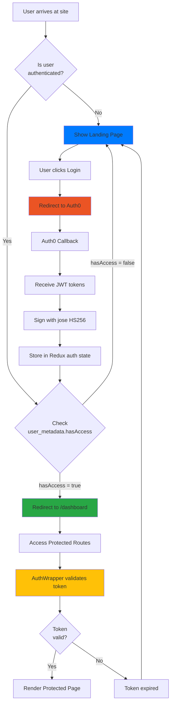
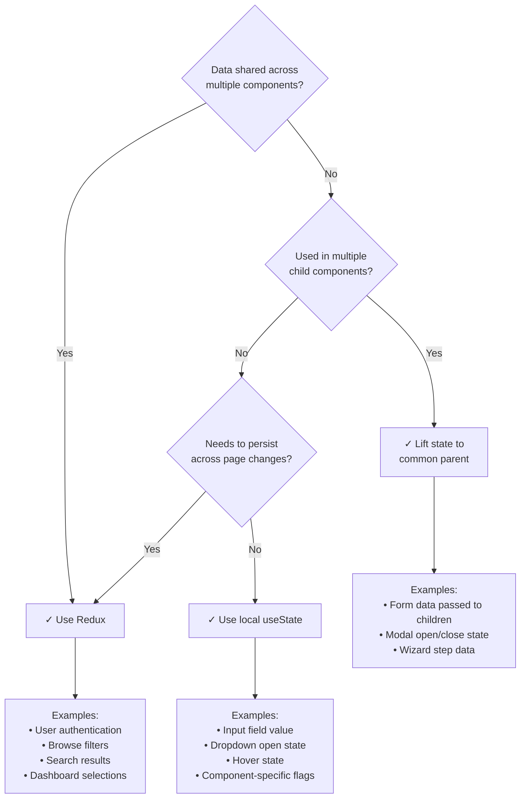
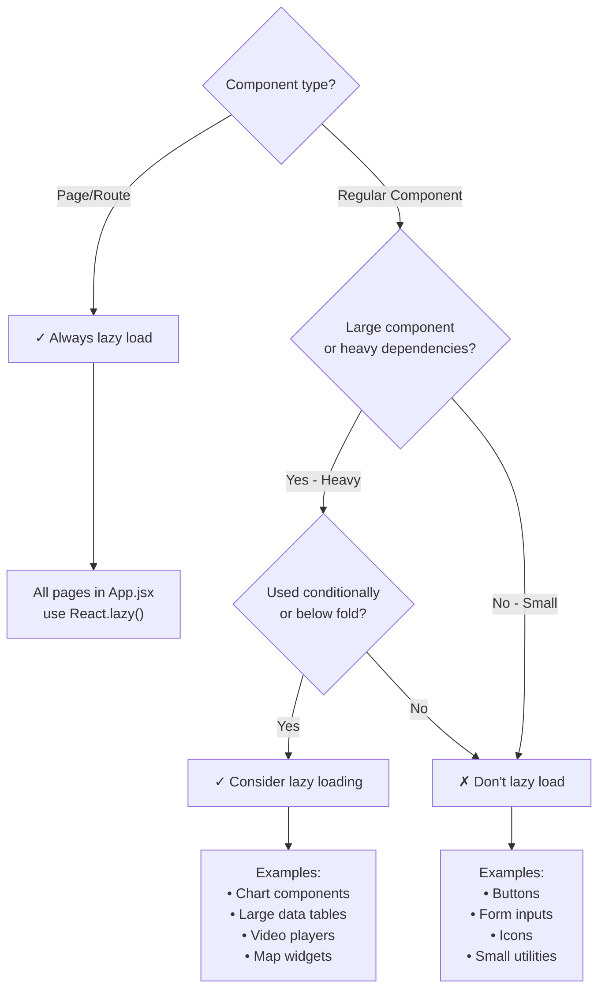

# MoTrPAC Data Hub - AI Agent Instructions

React 18 + Redux web application for the Molecular Transducers of Physical Activity Consortium (MoTrPAC) data repository. Built with Vite, serving biomedical research data with Auth0 authentication and Google Cloud Storage integration.

---

## Quick Reference

### Common Commands

```bash
yarn start              # Dev server (Vite on :5173)
yarn test              # Run Vitest tests
yarn test --coverage   # Coverage report
yarn test --ui         # Interactive test UI
yarn storybook         # Storybook on :9009
yarn sass              # Compile SCSS separately
yarn sass-lint         # Lint SCSS files
yarn format            # Prettier formatting
```

### Adding a New Page (5 Steps)

- **Create feature folder**: `src/NewFeaturePage/`

- **Create files**:

- `newFeaturePage.jsx` (main component)

- `newFeatureActions.js` (action types & creators)

- `newFeatureReducer.js` (reducer with default state)

- **Add lazy route** in `src/App/App.jsx`:

```javascript
const NewFeaturePageConnected = lazy(() => import('../NewFeaturePage/newFeaturePage'));
// In Routes: <Route path="/new-feature" element={<NewFeaturePageConnected/>} />
```

- **Register reducer** in `src/App/reducers.js`:

```javascript
import newFeatureReducer, { defaultNewFeatureState } from '../NewFeaturePage/newFeatureReducer';
// Add to combineReducers and defaultRootState
```

- **Create tests**: `__test__/newFeature.stories.jsx` and `__test__/newFeature.test.jsx`

### Connecting to Redux

**Modern Pattern (Use for New Components):**

```javascript
import { useSelector, useDispatch } from 'react-redux';

function Component() {
  const data = useSelector(state => state.feature.data);
  const dispatch = useDispatch();

  const handleAction = () => {
    dispatch(actionCreator());
  };

  return <div>{data}</div>;
}

export default Component;
```

**Legacy Pattern (Existing Components Only):**

```javascript
import { connect } from 'react-redux';

// Always export pure component for testing
export function Component({ data, action }) {
  return <div>{data}</div>;
}

const mapStateToProps = state => ({ data: state.feature.data });
const mapDispatchToProps = { action: actionCreator };

// Default export for app usage
export default connect(mapStateToProps, mapDispatchToProps)(Component);
```

### Making API Calls

```javascript
// In actions file (e.g., src/BrowseDataPage/browseDataActions.js)
import axios from 'axios';

export const FETCH_DATA_SUCCESS = 'FETCH_DATA_SUCCESS';
export const FETCH_DATA_ERROR = 'FETCH_DATA_ERROR';

export function fetchData() {
  return (dispatch) => {
    // Environment-aware endpoint
    const api = import.meta.env.DEV
      ? import.meta.env.VITE_API_SERVICE_ADDRESS_DEV
      : import.meta.env.VITE_API_SERVICE_ADDRESS;

    axios.get(`${api}/endpoint`)
      .then(response => {
        dispatch({ type: FETCH_DATA_SUCCESS, payload: response.data });
      })
      .catch(error => {
        dispatch({ type: FETCH_DATA_ERROR, payload: error.message });
      });
  };
}
```

### Import Aliases

```javascript
// Use these aliases (configured in vite.config.js)
import Component from '@/ComponentName/component';  // src/ComponentName
import '@styles/file.scss';                         // src/sass/

// Use relative imports for sibling directories
import './localFile';
import '../ParentDir/file';
```

---

## Table of Contents

- [Quick Reference](#quick-reference)

- [Architecture](#architecture)

- [System Overview Diagram](#system-overview-diagram)

- [Tech Stack](#tech-stack)

- [Feature Organization Pattern](#feature-organization-pattern)

- [Redux Patterns](#redux-patterns)

- [Data Flow Diagram](#redux-data-flow-diagram)

- [State Structure](#state-structure)

- [Action Patterns](#action-patterns)

- [Routing & Authentication](#routing--authentication)

- [Authentication Flow Diagram](#authentication-flow-diagram)

- [Protected Routes](#protected-routes)

- [Component Patterns](#component-patterns)

- [Development Workflows](#development-workflows)

- [Testing Requirements](#testing-requirements)

- [Common Tasks](#common-tasks)

- [Common Pitfalls & Anti-Patterns](#common-pitfalls--anti-patterns)

- [Troubleshooting Guide](#troubleshooting-guide)

- [Performance Considerations](#performance-considerations)

- [Project-Specific Conventions](#project-specific-conventions)

- [File Structure Reference](#file-structure-reference)

- [Critical Context](#critical-context)

- [CI/CD Notes](#cicd-notes)

---

## Architecture

### System Overview Diagram



### Tech Stack

- **Build System**: Vite 5 + React 18 (with SWC compiler for fast refresh)

- **State Management**: Redux with `redux-thunk` for async actions

- **Routing**: React Router v6 (client-side routing)

- **Authentication**: Auth0 with JWT signing (jose library, HS256 algorithm)

- **Testing**:

- Unit Tests: Vitest + React Testing Library

- Visual Tests: Storybook

- **Styling**:

- Sass (compiled separately via `yarn sass`)

- Bootstrap 4 (global classes available)

- StyleLint for SCSS linting

- **HTTP Client**: axios

- **Icons**: Centralized in `src/lib/iconSet.js`

- **Charts**: Chart.js with react-chartjs-2

### Feature Organization Pattern

Each major feature follows this consistent structure:

```
src/[FeatureName]/
├── [feature]Page.jsx           # Main page component
├── [feature]Actions.js         # Redux action types & creators
├── [feature]Reducer.js         # Redux reducer with defaultState export
├── components/                 # Feature-specific components (optional)
│   └── [subComponent].jsx
└── __test__/
    ├── [feature].stories.jsx   # Storybook stories
    └── [feature].test.jsx      # Vitest unit tests
```

**Real Examples:**

- `src/Dashboard/` → `dashboard.jsx`, `dashboardActions.js`, `dashboardReducer.js`

- `src/BrowseDataPage/` → `browseDataPage.jsx`, `browseDataActions.js`, `browseDataReducer.js`

- `src/AnalysisPage/` → `analysisHomePage.jsx`, `analysisActions.js`, `analysisReducer.js`

---

## Redux Patterns

### Redux Data Flow Diagram



### State Structure

**Root State Shape** (from `src/App/reducers.js:34-43`):

```javascript
{
  auth: {
    isAuthenticated: false,
    profile: null,              // Auth0 user profile
    userLogin: false,
    accessToken: null,
    idToken: null,
    // ... see src/Auth/authReducer.js for full structure
  },

  analysis: {
    // Analysis page data, filters, selections
    // See src/AnalysisPage/analysisReducer.js
  },

  search: {
    // Search query, results, filters
    // See src/Search/searchReducer.js
  },

  dataSummary: {
    // Summary statistics and visualizations
    // See src/DataSummaryPage/dataSummaryPageReducer.js
  },

  dashboard: {
    release: 'pass1b-06',       // Current release selection
    phase: 'external',          // 'external' or 'internal'
    plot: 'assay',              // Plot type selection
    sort: 'tissue',             // Sort preference
    showQC: false,              // QC visibility toggle
  },

  dataStatus: {
    // QC report data, status tracking
    // See src/DataStatusPage/dataStatusReducer.js
  },

  browseData: {
    // File manifest, filters, selections, download queue
    // See src/BrowseDataPage/browseDataReducer.js
  },

  userSurvey: {
    // User survey responses and state
    // See src/UserSurvey/userSurveyReducer.js
  }
}
```

### Action Patterns

**Simple Synchronous Actions** (from `src/Dashboard/dashboardActions.js:7-12`):

```javascript
export const TOGGLE_RELEASE = 'TOGGLE_RELEASE';

function toggleRelease(release) {
  return {
    type: TOGGLE_RELEASE,
    release,  // Payload
  };
}

export default { toggleRelease, /* ... other actions */ };
```

**Async Thunk Actions** (typical pattern in `browseDataActions.js`):

```javascript
export const FETCH_MANIFEST_REQUEST = 'FETCH_MANIFEST_REQUEST';
export const FETCH_MANIFEST_SUCCESS = 'FETCH_MANIFEST_SUCCESS';
export const FETCH_MANIFEST_ERROR = 'FETCH_MANIFEST_ERROR';

export function fetchManifest(url) {
  return (dispatch) => {
    dispatch({ type: FETCH_MANIFEST_REQUEST });

    axios.get(url)
      .then(response => {
        dispatch({
          type: FETCH_MANIFEST_SUCCESS,
          payload: response.data
        });
      })
      .catch(error => {
        dispatch({
          type: FETCH_MANIFEST_ERROR,
          payload: error.message
        });
      });
  };
}
```

### Component Integration Patterns

**Modern Hook-Based (Use for New Components)**:

```javascript
import { useSelector, useDispatch } from 'react-redux';
import { fetchData } from './actions';

function DataComponent() {
  const data = useSelector(state => state.feature.data);
  const loading = useSelector(state => state.feature.loading);
  const dispatch = useDispatch();

  useEffect(() => {
    dispatch(fetchData());
  }, [dispatch]);

  if (loading) return <Spinner />;
  return <div>{data}</div>;
}

export default DataComponent;
```

**Legacy connect() Pattern (Maintain in Existing Components)**:

```javascript
import { connect } from 'react-redux';
import { fetchData } from './actions';

// Pure component - always export for testing
export function DataComponent({ data, loading, fetchData }) {
  useEffect(() => {
    fetchData();
  }, [fetchData]);

  if (loading) return <Spinner />;
  return <div>{data}</div>;
}

const mapStateToProps = state => ({
  data: state.feature.data,
  loading: state.feature.loading,
});

const mapDispatchToProps = {
  fetchData,
};

// Connected component - default export
export default connect(mapStateToProps, mapDispatchToProps)(DataComponent);
```

**When to Use Which:**



---

## Routing & Authentication

### Authentication Flow Diagram



### Protected Routes

Use `<AuthWrapper/>` component in `src/App/App.jsx` to protect routes:

```javascript
import AuthWrapper from '../Auth/AuthWrapper';

// In Routes:
<Route element={<AuthWrapper/>}>
  <Route path="/dashboard" element={<DashboardConnected/>} />
  <Route path="/browse-data" element={<BrowseDataPageConnected/>} />
  {/* All child routes require authentication */}
</Route>
```

### Auth Flow Implementation

**1. Auth0 Configuration** (`src/Auth/Auth.js`):

- Auth0 authentication with JWT

- Token signing using `jose` library (HS256 algorithm)

- Token storage in Redux state

**2. Access Control** (`profile.user_metadata.hasAccess`):

```javascript
// Check in components
const profile = useSelector(state => state.auth.profile);
const hasAccess = profile?.user_metadata?.hasAccess;

if (!hasAccess) {
  return <AccessDeniedMessage />;
}
```

**3. Navigation Rules**:

- **ALWAYS use `<Link>` from **`react-router-dom`, NEVER `<a>` tags

- `<a>` tags cause full page reloads and break SPA behavior

- History managed via `src/App/history.jsx`

```javascript
// ✓ Correct
import { Link } from 'react-router-dom';
<Link to="/dashboard">Dashboard</Link>

// ✗ Wrong - causes full reload
<a href="/dashboard">Dashboard</a>
```

---

## Component Patterns

### Pure vs Connected Components

**Always export BOTH** pure and connected components for testability:

```javascript
// Pure component - named export for testing
export function Dashboard({ release, phase, onToggle }) {
  return (
    <div>
      <h1>Dashboard</h1>
      <button onClick={() => onToggle('pass1b-06')}>
        {release}
      </button>
    </div>
  );
}

// Connected component - default export for app
const mapStateToProps = state => ({
  release: state.dashboard.release,
  phase: state.dashboard.phase,
});

const mapDispatchToProps = {
  onToggle: toggleRelease,
};

export default connect(mapStateToProps, mapDispatchToProps)(Dashboard);
```

**Why this matters:**

- Pure component can be tested without Redux store

- Connected component used in actual app

- Tests can verify component logic independently

### Custom Hooks Pattern

Create reusable hooks for common logic:

```javascript
// src/lib/hooks/useAuth.js
import { useSelector } from 'react-redux';

export function useAuth() {
  const profile = useSelector(state => state.auth.profile);
  const isAuthenticated = useSelector(state => state.auth.isAuthenticated);
  const hasAccess = profile?.user_metadata?.hasAccess;

  return { profile, isAuthenticated, hasAccess };
}

// Usage in components
import { useAuth } from '@/lib/hooks/useAuth';

function ProtectedFeature() {
  const { hasAccess } = useAuth();

  if (!hasAccess) return <AccessDenied />;
  return <Feature />;
}
```

### Loading States Pattern

```javascript
function DataComponent() {
  const { data, loading, error } = useSelector(state => state.feature);

  if (loading) {
    return <Spinner />;  // From src/lib/ui/spinner.jsx
  }

  if (error) {
    return <ErrorMessage message={error} />;
  }

  if (!data || data.length === 0) {
    return <EmptyState message="No data available" />;
  }

  return <DataDisplay data={data} />;
}
```

### Lazy Loading Pattern

All page routes use `React.lazy()` for code splitting (from `src/App/App.jsx:13-75`):

```javascript
import React, { lazy, Suspense } from 'react';

const Dashboard = lazy(() => import('../Dashboard/dashboard'));
const AnalysisPage = lazy(() => import('../AnalysisPage/analysisHomePage'));

function App() {
  return (
    <Suspense fallback={<Spinner />}>
      <Routes>
        <Route path="/dashboard" element={<Dashboard />} />
        <Route path="/analysis" element={<AnalysisPage />} />
      </Routes>
    </Suspense>
  );
}
```

---

## Development Workflows

### Environment Setup

**Requirements:**

- Node v20.19.x (use nvm: `nvm use v20.19.5`)

- Yarn 4 (specified in `package.json` packageManager)

**Environment Variables** (create `.env` file):

```bash
# Required for Vite to expose variables to client
ESLINT_NO_DEV_ERRORS=true
VITE_AUTH0_CLIENT_ID=your_auth0_client_id
VITE_AUTH0_DOMAIN=your_auth0_domain
VITE_API_SERVICE_ADDRESS=https://api.motrpac-data.org
VITE_API_SERVICE_ADDRESS_DEV=https://api-dev.motrpac-data.org
VITE_RECAPTCHA_SITE_KEY=your_recaptcha_key
# See browseDataActions.js for other VITE_* variables
```

**Initial Setup:**

```bash
nvm use v20.19.5
yarn install
```

### Common Development Tasks

**Start Development Server:**

```bash
yarn start  # Vite dev server on http://localhost:5173
```

**Run Tests:**

```bash
yarn test              # Run all tests
yarn test --ui         # Interactive test UI
yarn test --coverage   # Generate coverage report
yarn test path/to/file # Run specific test file
```

**Compile SCSS:**

```bash
yarn sass       # Compile all SCSS files
yarn sass-lint  # Lint SCSS files
```

**Storybook:**

```bash
yarn storybook  # Run Storybook on http://localhost:9009
```

**Code Formatting:**

```bash
yarn format  # Run Prettier on all files
```

### Development Best Practices

- **Never run **`yarn build`** in local environment** (per user rules)

- **Compile SCSS separately** before testing styled components

- **Run tests before committing** to catch issues early

- **Use Storybook** for component development in isolation

- **Check file size** if adding new dependencies (impacts bundle size)

---

## Testing Requirements

### Test Structure

Every feature requires **TWO** test files:

**1. Storybook Story** (`__test__/[component].stories.jsx`):

```javascript
import { Component } from '../component';
import Navbar from '../../Navbar/navbar';
import Footer from '../../Footer/footer';

export default {
  title: 'FeatureName/Component',
  component: Component,
  decorators: [
    (story) => (
      <>
        <Navbar />
        {story()}
        <Footer />
      </>
    ),
  ],
};

export const Default = {
  args: {
    prop1: 'value1',
    prop2: 'value2',
  },
};

export const WithData = {
  args: {
    data: [{ id: 1, name: 'Test' }],
  },
};
```

**2. Unit Tests** (`__test__/[component].test.jsx`):

```javascript
import { describe, test, expect, vi } from 'vitest';
import { render, screen } from '@testing-library/react';
import { Component } from '../component';  // Import pure component

describe('Component Name', () => {
  test('renders expected elements', () => {
    render(<Component prop1="value1" />);
    expect(screen.getByText('value1')).toBeInTheDocument();
  });

  test('handles user interaction', () => {
    const mockHandler = vi.fn();
    render(<Component onAction={mockHandler} />);

    screen.getByRole('button').click();
    expect(mockHandler).toHaveBeenCalledTimes(1);
  });
});
```

### Common Test Mocks

**React Router** (already configured in `setupTests.jsx`):

```javascript
vi.mock('react-router-dom', () => ({
  ...vi.importActual('react-router-dom'),
  Navigate: vi.fn(({ to }) => `Navigate to ${to}`),
  useNavigate: vi.fn(() => vi.fn()),
}));
```

**Chart.js Components**:

```javascript
vi.mock('react-chartjs-2', () => ({
  Bar: vi.fn(() => <div>Bar Chart</div>),
  Pie: vi.fn(() => <div>Pie Chart</div>),
  Doughnut: vi.fn(() => <div>Doughnut Chart</div>),
}));
```

**Redux Store for Testing**:

```javascript
import { Provider } from 'react-redux';
import { createStore } from 'redux';
import rootReducer, { defaultRootState } from '../../App/reducers';

const store = createStore(rootReducer, defaultRootState);

render(
  <Provider store={store}>
    <ComponentConnected />
  </Provider>
);
```

---

## Common Tasks

### Task: Add a New Redux Action

- **Define action type** in `[feature]Actions.js`:

```javascript
export const NEW_ACTION = 'FEATURE_NEW_ACTION';
```

- **Create action creator**:

```javascript
export function newAction(payload) {
  return {
    type: NEW_ACTION,
    payload,
  };
}
```

- **Handle in reducer** (`[feature]Reducer.js`):

```javascript
case NEW_ACTION:
  return {
    ...state,
    newProperty: action.payload,
  };
```

- **Dispatch from component**:

```javascript
const dispatch = useDispatch();
dispatch(newAction(data));
```

### Task: Add a Protected Route

- **Create lazy-loaded component** in `App.jsx`:

```javascript
const NewPage = lazy(() => import('../NewPage/newPage'));
```

- **Add route inside **`<AuthWrapper/>`:

```javascript
<Route element={<AuthWrapper/>}>
  <Route path="/new-page" element={<NewPage/>} />
</Route>
```

- **Add navigation link**:

```javascript
<Link to="/new-page">New Page</Link>
```

### Task: Make an Authenticated API Call

```javascript
// In actions file
import axios from 'axios';

export function fetchProtectedData() {
  return (dispatch, getState) => {
    const { accessToken } = getState().auth;
    const api = import.meta.env.VITE_API_SERVICE_ADDRESS;

    axios.get(`${api}/protected-endpoint`, {
      headers: {
        Authorization: `Bearer ${accessToken}`,
      },
    })
      .then(response => {
        dispatch({ type: FETCH_SUCCESS, payload: response.data });
      })
      .catch(error => {
        dispatch({ type: FETCH_ERROR, payload: error.message });
      });
  };
}
```

### Task: Add a New Environment Variable

- **Add to **`.env`** file with **`VITE_`** prefix**:

```bash
VITE_NEW_CONFIG=value
```

- **Access in code**:

```javascript
const config = import.meta.env.VITE_NEW_CONFIG;
```

- **Add to CI/CD secrets** (CircleCI, GitHub Actions)

---

## Common Pitfalls & Anti-Patterns

### 1. Mutating Redux State ❌

**Problem:** Directly modifying state object breaks Redux's immutability contract.

**Wrong:**

```javascript
// dashboardReducer.js
function reducer(state = defaultState, action) {
  switch (action.type) {
    case TOGGLE_RELEASE:
      state.release = action.release;  // ❌ MUTATION!
      return state;
  }
}
```

**Correct:**

```javascript
function reducer(state = defaultState, action) {
  switch (action.type) {
    case TOGGLE_RELEASE:
      return { ...state, release: action.release };  // ✓ New object
  }
}
```

### 2. Using `<a>` Instead of `<Link>` ❌

**Problem:** `<a>` tags cause full page reload, breaking SPA behavior and Redux state.

**Wrong:**

```jsx
<a href="/dashboard">Dashboard</a>  // ❌ Full page reload!
```

**Correct:**

```jsx
import { Link } from 'react-router-dom';
<Link to="/dashboard">Dashboard</Link>  // ✓ Client-side navigation
```

### 3. Forgetting `VITE_` Prefix on Environment Variables ❌

**Problem:** Vite only exposes variables with `VITE_` prefix to client code.

**Wrong:**

```bash
# .env
AUTH0_CLIENT_ID=abc123  # ❌ Not accessible!
```

**Correct:**

```bash
# .env
VITE_AUTH0_CLIENT_ID=abc123  # ✓ Accessible via import.meta.env
```

**Usage:**

```javascript
const clientId = import.meta.env.VITE_AUTH0_CLIENT_ID;
```

### 4. Not Exporting Pure Component ❌

**Problem:** Can't test component logic without Redux overhead.

**Wrong:**

```javascript
function Dashboard({ data }) { /* ... */ }
export default connect(mapStateToProps)(Dashboard);  // ❌ Can't test pure component
```

**Correct:**

```javascript
export function Dashboard({ data }) { /* ... */ }  // ✓ Named export for tests
export default connect(mapStateToProps)(Dashboard);  // ✓ Default export for app
```

**In tests:**

```javascript
import { Dashboard } from '../dashboard';  // Test pure component
```

### 5. Incorrect Import Paths ❌

**Problem:** Deep relative imports are hard to maintain.

**Wrong:**

```javascript
import Component from '../../../lib/ui/component';  // ❌ Hard to refactor
```

**Correct:**

```javascript
import Component from '@/lib/ui/component';  // ✓ Use configured alias
```

### 6. Inline Styles with SCSS ❌

**Problem:** SCSS must be compiled separately, not imported in JSX.

**Wrong:**

```javascript
import './styles.scss';  // ❌ Not compiled by Vite in this project
```

**Correct:**

```javascript
// Add styles to src/sass/main.scss
// Then run: yarn sass
// Reference classes in JSX:
<div className="my-component">...</div>
```

### 7. Not Handling Loading/Error States ❌

**Wrong:**

```javascript
function Component() {
  const data = useSelector(state => state.feature.data);
  return <div>{data.map(...)}</div>;  // ❌ Crashes if data is null/undefined
}
```

**Correct:**

```javascript
function Component() {
  const { data, loading, error } = useSelector(state => state.feature);

  if (loading) return <Spinner />;
  if (error) return <ErrorMessage error={error} />;
  if (!data) return <EmptyState />;

  return <div>{data.map(...)}</div>;  // ✓ Safe
}
```

### 8. Missing Redux State in Reducer Registration ❌

**Problem:** Adding reducer to `combineReducers` but forgetting `defaultRootState`.

**Wrong:**

```javascript
// src/App/reducers.js
export default combineReducers({
  newFeature: newFeatureReducer,  // ✓ Added here
  // ... other reducers
});

export const defaultRootState = {
  // ❌ Forgot to add newFeature: defaultNewFeatureState
};
```

**Correct:**

```javascript
import newFeatureReducer, { defaultNewFeatureState } from '../NewFeature/newFeatureReducer';

export default combineReducers({
  newFeature: newFeatureReducer,
});

export const defaultRootState = {
  newFeature: defaultNewFeatureState,  // ✓ Added here too
};
```

---

## Troubleshooting Guide

### Tests Fail: "Cannot find module 'react-router-dom'"

**Cause:** Missing or incorrect mock in test setup.

**Solution:** Check `setupTests.jsx` includes React Router mocks:

```javascript
vi.mock('react-router-dom', () => ({
  ...vi.importActual('react-router-dom'),
  Navigate: vi.fn(({ to }) => `Navigate to ${to}`),
  useNavigate: vi.fn(() => vi.fn()),
}));
```

### Auth0 Error: "Token has expired"

**Cause:** JWT token expired (default: 24 hours).

**Solution:**

- Log out completely from the app

- Clear browser localStorage: `localStorage.clear()`

- Clear cookies for the domain

- Log back in to get fresh tokens

**Prevention:** Implement token refresh logic in `src/Auth/Auth.js`.

### SCSS Changes Not Reflected in Browser

**Cause:** SCSS not recompiled.

**Solution:**

```bash
yarn sass        # Compile SCSS manually
yarn start       # Restart dev server if needed
```

**Tip:** SCSS compilation is separate from Vite. Must run `yarn sass` after SCSS changes.

### Error: "Cannot read property 'map' of undefined"

**Cause:** Accessing data before it's loaded, or missing null check.

**Solution:** Always check loading/error states:

```javascript
const { data, loading, error } = useSelector(state => state.feature);

if (loading) return <Spinner />;
if (error) return <ErrorMessage error={error} />;
if (!data || data.length === 0) return <EmptyState />;

return <div>{data.map(item => ...)}</div>;
```

### Module Not Found: `@/ComponentName`

**Cause:** Vite alias not configured or typo in path.

**Solution:**

- Check `vite.config.js` has correct alias:

```javascript
resolve: {
  alias: {
    '@': path.resolve(__dirname, './src'),
    '@styles': path.resolve(__dirname, './src/sass'),
  }
}
```

- Verify import path matches directory structure

- Restart dev server after config changes

### Chart.js Error: "Canvas is already in use"

**Cause:** Multiple Chart.js instances rendering to same canvas.

**Solution:** Ensure each chart has unique `id` or use React key:

```javascript
<Bar key={uniqueId} data={chartData} options={options} />
```

### Redux State Not Updating in Component

**Cause:** Selector pointing to wrong state path or state mutation.

**Solution:**

- Verify state path in Redux DevTools

- Check reducer returns new object (not mutated state)

- Ensure action is dispatched correctly:

```javascript
console.log('Dispatching action:', action);
dispatch(action);
```

### Error: "Node version incompatible"

**Cause:** Using Node version other than 20.19.x.

**Solution:**

```bash
nvm use v20.19.5
nvm alias default v20.19.5  # Set as default
```

**Note:** Node 20 is required due to legacy dependencies. CI uses Node 20, but local dev requires Node 20.

---

## Performance Considerations

### Bundle Size Optimization

**Current Setup:**

- All page routes use `React.lazy()` for code splitting

- Reduces initial bundle size

- Each page loads only when accessed

**Check Bundle Size:**

```bash
yarn build
npx vite-bundle-visualizer
```

**Tips:**

- Keep Chart.js imports specific: `import { Bar } from 'react-chartjs-2'`

- Avoid importing entire libraries: use tree-shakeable imports

- Lazy-load heavy components (charts, tables, visualizations)

### Chart.js Performance

**Large Datasets:**

```javascript
// Use decimation plugin for line charts with many points
const options = {
  plugins: {
    decimation: {
      enabled: true,
      algorithm: 'lttb',  // Largest Triangle Three Bucket
      samples: 500,
    },
  },
};
```

**Data Table Optimization:**

- Implement pagination (don't render 1000+ rows at once)

- Use virtualization for long tables (`react-window` or `react-virtualized`)

- Limit initial data fetch, load more on demand

### useMemo and useCallback Guidelines

**Use **`useMemo`** when:**

- Filtering/sorting large arrays (100+ items)

- Complex calculations (date parsing, aggregations)

- Creating objects passed to memoized children

```javascript
const filteredData = useMemo(() => {
  return largeDataset.filter(item => item.category === filter);
}, [largeDataset, filter]);
```

**Use **`useCallback`** when:**

- Passing callbacks to memoized child components

- Functions used in dependency arrays

```javascript
const handleSort = useCallback((column) => {
  dispatch(setSortColumn(column));
}, [dispatch]);
```

**Don't use when:**

- Simple operations (string concat, basic math)

- Primitives (numbers, strings, booleans)

- Component doesn't have performance issues

**Rule of thumb:** Profile first, optimize second. Don't prematurely optimize.

### Network Performance

**API Calls:**

- Use pagination for large datasets

- Implement request debouncing for search inputs

- Cache responses when appropriate

- Use signed URLs from GCS for large file downloads (already implemented)

**Static Assets:**

- Large images served via CloudFront CDN: `https://d1yw74buhe0ts0.cloudfront.net/static/motrpac-data-hub/images/`

- Icons imported as modules (tree-shakeable)

---

## Project-Specific Conventions

### Import Aliases

Configured in `vite.config.js`:

```javascript
import Component from '@/ComponentName/component';  // src/ComponentName
import '@styles/file.scss';                         // src/sass/
```

**Guidelines:**

- Use aliases for cross-feature imports

- Use relative imports (`../`) for sibling directories

- Never use deep relative imports (`../../../`)

### Styling Rules

**Global Styles:**

- `src/sass/main.scss` imports all SCSS partials

- Compiled separately: `yarn sass`

- Bootstrap 4 classes available globally

**Component Styles:**

- Create dedicated SCSS files (e.g., `src/sass/landingPage.scss`)

- Import in `main.scss`

- Use BEM naming convention where appropriate

- Follow StyleLint recommended rules

**No Inline CSS Compilation:**

- SCSS files are NOT imported in JSX

- Must run `yarn sass` to compile

- Compiled CSS loaded globally

**Bootstrap 4 (Not v5):**

- Existing components depend on Bootstrap 4 classes

- Do not upgrade to Bootstrap 5 (breaking changes)

### Static Assets

**Icons:**

- Centralized in `src/lib/iconSet.js`

- Imported as ES6 modules

- Allows tree-shaking (only used icons bundled)

**Large Images:**

- Served via CloudFront CDN

- Base URL: `https://d1yw74buhe0ts0.cloudfront.net/static/motrpac-data-hub/images/`

- Reduces bundle size and improves load times

**Static Data:**

- JSON files in `src/data/`

- Study datasets, metadata, configurations

### API Integration

**Environment-Aware Endpoints:**

```javascript
const api = import.meta.env.DEV
  ? import.meta.env.VITE_API_SERVICE_ADDRESS_DEV
  : import.meta.env.VITE_API_SERVICE_ADDRESS;
```

**HTTP Client:**

- Use `axios` for all API calls

- See `src/BrowseDataPage/browseDataActions.js` for signed URL patterns with Google Cloud Storage

### Component Reusability

**Common UI Components** (`src/lib/ui/`):

- `pageTitle.jsx` - Consistent page headers

- `externalLink.jsx` - External links with icon

- `spinner.jsx` - Loading indicator

- `contactHelpdesk.jsx` - Help contact component

**Shared Feature Logic** (`src/lib/`):

- `browseDataFilters.js` - Data filtering utilities

- `assayList.js` - Assay type definitions

- `iconSet.js` - Icon registry

---

## File Structure Reference

```
motrpac-frontend/
├── .github/
│   └── copilot-instructions.md    # This file
├── public/                         # Static assets served at root
├── src/
│   ├── AnalysisPage/              # Analysis feature module
│   │   ├── analysisHomePage.jsx
│   │   ├── analysisActions.js
│   │   ├── analysisReducer.js
│   │   ├── GeneCentricViewRat/    # Sub-feature
│   │   ├── GraphicalClustering/   # Sub-feature
│   │   └── __test__/
│   │       ├── analysisHomePage.stories.jsx
│   │       └── analysisHomePage.test.jsx
│   │
│   ├── App/
│   │   ├── App.jsx                # Main app with routes (line 77+)
│   │   ├── reducers.js            # Combined reducers (line 23, 34-43)
│   │   └── history.jsx            # Router history
│   │
│   ├── Auth/
│   │   ├── Auth.js                # Auth0 integration + JWT signing
│   │   ├── authActions.js
│   │   ├── authReducer.js
│   │   ├── AuthWrapper.jsx        # Protected route wrapper
│   │   └── callback.jsx           # Auth0 callback handler
│   │
│   ├── BrowseDataPage/            # File browser feature
│   │   ├── browseDataPage.jsx
│   │   ├── browseDataActions.js   # GCS signed URLs, file manifest
│   │   ├── browseDataReducer.js
│   │   └── components/
│   │
│   ├── Dashboard/                 # User dashboard
│   │   ├── dashboard.jsx
│   │   ├── dashboardActions.js    # Simple sync actions (line 7-12)
│   │   └── dashboardReducer.js
│   │
│   ├── DataStatusPage/            # QC reports
│   ├── DataSummaryPage/           # Summary statistics
│   ├── Search/                    # Search feature
│   ├── UserSurvey/                # User surveys
│   │
│   ├── lib/
│   │   ├── ui/                    # Reusable UI components
│   │   │   ├── pageTitle.jsx
│   │   │   ├── spinner.jsx
│   │   │   └── externalLink.jsx
│   │   ├── iconSet.js             # Centralized icon imports
│   │   └── browseDataFilters.js   # Shared filter logic
│   │
│   ├── sass/
│   │   ├── main.scss              # Main SCSS file (imports all)
│   │   ├── _variables.scss
│   │   ├── _mixins.scss
│   │   └── [feature].scss         # Feature-specific styles
│   │
│   ├── data/                      # Static JSON data
│   │   ├── studyDatasets.json
│   │   └── metadata.json
│   │
│   └── setupTests.jsx             # Vitest test configuration
│
├── vite.config.js                 # Vite configuration (aliases, etc.)
├── package.json                   # Dependencies (Node 16, Yarn 4)
├── .env                           # Environment variables (VITE_*)
└── README.md
```

---

## Critical Context

### Key Constraints

**Runtime Environment:**

- **Node v20.19.x only** - Local development requires Node 20

- **Yarn 4** - Specified in `package.json` packageManager field

- CI runs on Node 20 (compatibility with legacy deps in dev only)

**Dependencies:**

- **Bootstrap 4** (NOT v5) - Existing components depend on v4 classes

- **Vitest** (NOT Jest) - Migration from Jest to Vitest complete

- **Vite** (NOT Create React App) - Migrated for build performance

**SCSS Compilation:**

- SCSS compiled separately via `yarn sass`

- NOT compiled by Vite during dev/build

- Must run `yarn sass` after SCSS changes

### Data Flow

**Typical User Journey:**

- **Browse Data** → User applies filters in `BrowseDataPage`

- **Redux State Update** → Actions dispatch filter changes to Redux

- **Backend API Call** → Paginated data fetch (not all data at once)

- **GCS Signed URLs** → Download links generated via signed URLs from Google Cloud Storage

- **File Download** → User downloads files directly from GCS

**Key Points:**

- Pagination used throughout (prevent loading large datasets at once)

- Signed URLs have expiration (typically 1 hour)

- Auth0 JWT token validates access to protected data

### Lazy Loading Strategy

All page routes use `React.lazy()` (from `src/App/App.jsx:13-75`):

```javascript
const Dashboard = lazy(() => import('../Dashboard/dashboard'));
const AnalysisPage = lazy(() => import('../AnalysisPage/analysisHomePage'));
// ... all pages lazy-loaded
```

**Benefits:**

- Smaller initial bundle size

- Faster first contentful paint

- Code-split per route

### Storybook Decorators

Stories wrap components with Navbar/Footer for consistent layout:

```javascript
export default {
  title: 'Feature/Component',
  component: Component,
  decorators: [
    (story) => (
      <>
        <Navbar {...navbarAction} />
        {story()}
        <Footer />
      </>
    ),
  ],
};
```

**Why:** Provides full page context for component preview in Storybook.

---

## When Editing

### Adding a New Page

- **Follow feature organization pattern** (see [Feature Organization Pattern](#feature-organization-pattern))

- **Create folder**: `src/NewFeaturePage/`

- **Create files**: `newFeaturePage.jsx`, `newFeatureActions.js`, `newFeatureReducer.js`

- **Add route** in `src/App/App.jsx` with lazy loading:

```javascript
const NewFeaturePage = lazy(() => import('../NewFeaturePage/newFeaturePage'));

// In <Routes>:
<Route path="/new-feature" element={<NewFeaturePage/>} />
```

- **Register reducer** in `src/App/reducers.js`:

```javascript
import newFeatureReducer, { defaultNewFeatureState } from '../NewFeaturePage/newFeatureReducer';

export default combineReducers({
  newFeature: newFeatureReducer,
  // ... other reducers
});

export const defaultRootState = {
  newFeature: defaultNewFeatureState,
  // ... other default states
};
```

- **Create tests**: Storybook story and Vitest tests

### Updating Redux State

**Order of operations:**

- **Update actions file** (`[feature]Actions.js`):

- Add action type constant

- Create action creator function

- **Update reducer file** (`[feature]Reducer.js`):

- Handle new action type in reducer switch

- Update default state if needed

- **Update components**:

- Dispatch new actions

- Select new state slices

### Styling Changes

- **Edit SCSS** in `src/sass/[file].scss`

- **Compile SCSS**: `yarn sass`

- **Test changes** in browser

- **Run linter**: `yarn sass-lint`

**Note:** SCSS changes require manual compilation. Dev server doesn't auto-compile SCSS.

### Auth-Protected Features

**Check access in component logic:**

```javascript
import { useSelector } from 'react-redux';

function ProtectedFeature() {
  const profile = useSelector(state => state.auth.profile);
  const hasAccess = profile?.user_metadata?.hasAccess;

  if (!hasAccess) {
    return <AccessDeniedMessage />;
  }

  return <ProtectedContent />;
}
```

**Or wrap route with **`<AuthWrapper/>` (see [Protected Routes](#protected-routes)).

### Environment Variables

**Adding new config:**

- **Prefix with **`VITE_`: Only `VITE_*` variables exposed to client

- **Add to **`.env`:

```bash
VITE_NEW_CONFIG=value
```

- **Access in code**:

```javascript
const config = import.meta.env.VITE_NEW_CONFIG;
```

- **Add to CI/CD secrets** (CircleCI, GitHub Actions)

---

## CI/CD Notes

### Continuous Integration

**Platforms:**

- **CircleCI** - Primary CI pipeline

- **GitHub Actions** - Secondary checks

**Test Environment:**

- Node 20 (tests run on newer Node than dev)

- All tests must pass before merge

**Required Secrets:**

- `VITE_AUTH0_CLIENT_ID`

- `VITE_RECAPTCHA_SITE_KEY`

- Other `VITE_*` environment variables

### Cross-Browser Testing

- **SauceLabs** integration for cross-browser testing

- Tests run on multiple browsers/versions

- Ensure compatibility before release

### Deployment Workflow

- **Develop** → Create feature branch

- **Test** → Run `yarn test` and `yarn storybook`

- **Commit** → Push to GitHub

- **CI** → Automated tests run on CircleCI

- **Review** → Code review and approval

- **Merge** → Merge to main branch

- **Deploy** → Automated deployment to production

---

## Decision Trees

### When to Use Redux vs Local State



### When to Lazy Load a Component



---

## Summary

This comprehensive guide covers the MoTrPAC Data Hub architecture, patterns, and conventions. Key takeaways:

**Architecture:**

- React 18 + Redux + React Router v6

- Vite build system with SWC

- Auth0 authentication with JWT

- Feature-based organization

**Redux Patterns:**

- Thunk middleware for async actions

- 8 feature reducers in combined store

- Modern hooks (useSelector/useDispatch) preferred

- Legacy connect() maintained in existing components

**Critical Rules:**

- ALWAYS use `<Link>`, NEVER `<a>` tags

- Environment variables MUST have `VITE_` prefix

- Export BOTH pure and connected components

- Run `yarn sass` after SCSS changes

- Never mutate Redux state

- Node 16.20.x required for local dev

**Testing:**

- Storybook stories for visual testing

- Vitest + RTL for unit tests

- Mock React Router and Chart.js components

**Performance:**

- All routes lazy-loaded

- Chart.js optimization for large datasets

- useMemo/useCallback for expensive operations

- CDN for large static assets

For questions or clarifications, refer to specific sections above or check the actual source files referenced throughout this guide.